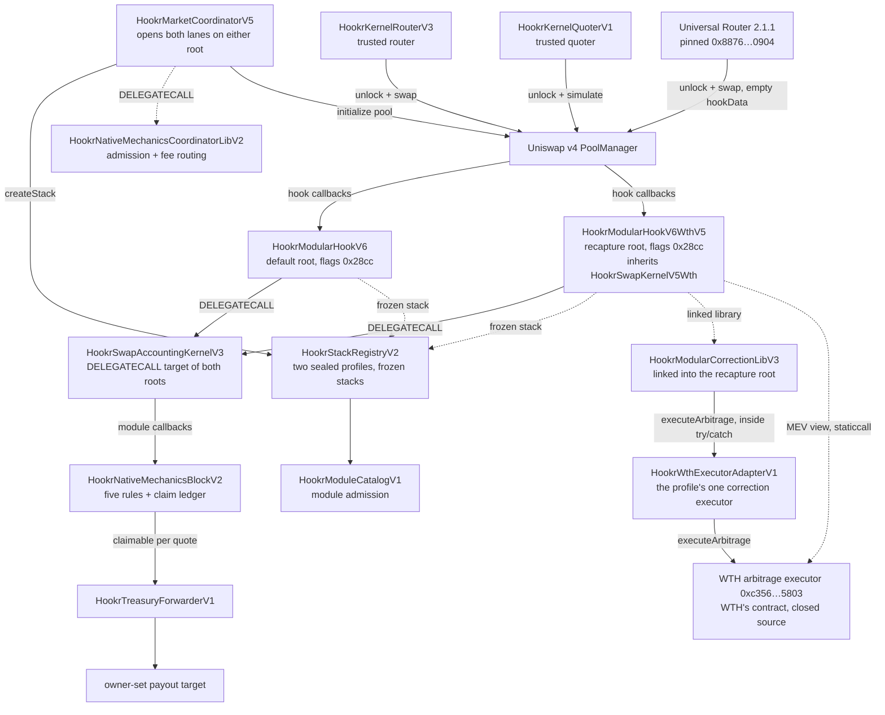

# Hookr contracts

Hookr is two Uniswap v4 hooks that serve many pools. Both are roots on one registry and share one accounting kernel, one module, one coordinator, one router, one quoter and one treasury forwarder. The default root, `HookrModularHookV6` at [`0xb3cA29cF721380CEe8b8e4755F3865Ebc68Fe8cC`](https://robinhoodchain.blockscout.com/address/0xb3cA29cF721380CEe8b8e4755F3865Ebc68Fe8cC), runs five rules and nothing else. The recapture root, `HookrModularHookV6WthV5` at [`0xb914f955294799de4b891bd2EA8AF628Fa1c68CC`](https://robinhoodchain.blockscout.com/address/0xb914f955294799de4b891bd2EA8AF628Fa1c68CC), runs the same five rules and adds a partner correction lane: on every swap of an ETH-quoted pool it asks WTH's arbitrage executor, through a Hookr adapter, to trade the pool's price gap against its other venues and split the realised profit between the pool's creator, the trader, the pool's LPs, WTH and Hookr. A pool opened through Hookr names one root and freezes its configuration at creation; the root reads that frozen record on every callback, so nothing about the pool's rules can change afterwards, including by the Hookr owner. The rules are a surge LP fee that rises with trade size against in-range depth, a temporal guard window on new launches, an auto-burn of subject output on exact-input buys, an in-swap LP-reward donation, and an Nth-buy pot. All five work on any quote currency, native or ERC-20. The protocol's revenue is a share carved out of those opt-in rules and never out of the base LP fee, so a pool that runs on its base fee alone produces no protocol revenue at all.

This repository holds the sources behind the contracts live on Robinhood Chain, the documentation for them, and the addresses. Earlier generations of Hookr stay live on chain and are kept under [`legacy/`](./legacy/README.md).

## Architecture



Both roots delegate every callback to the same accounting kernel and the same native block, so a pool's five rules behave identically on either. The recapture root differs in its swap kernel: `HookrSwapKernelV5Wth` runs a bounded, fail-open correction attempt before and after the delegated swap body, through the linked `HookrModularCorrectionLibV3` to `HookrWthExecutorAdapterV1`, which forwards to WTH's executor. A revert anywhere on that path is a skipped correction, never a failed swap, with one narrow exception described on the [recapture root's page](./docs/reference/HookrModularHookV6WthV5.md).

## Where to read

| Question | Page |
| --- | --- |
| What is this and what are the two lanes? | [Overview](./docs/concepts/overview.md) |
| What does each contract do? | [Architecture](./docs/concepts/architecture.md) |
| What does the recapture root add, and what does it trust? | [HookrModularHookV6WthV5](./docs/reference/HookrModularHookV6WthV5.md) |
| What does a pool do from creation to steady state? | [Pool lifecycle](./docs/concepts/pool-lifecycle.md) |
| Who pays what, on which leg? | [Fee model](./docs/concepts/fee-model.md) |
| What happens during a launch window? | [Guard window](./docs/concepts/guard-window.md) |
| How does each of the five rules work? | [Native mechanics](./docs/concepts/native-mechanics.md) |
| Where does the protocol's share go? | [Protocol share and treasury](./docs/concepts/protocol-share-and-treasury.md) |
| What can the owner do? | [Immutability and ownership](./docs/concepts/immutability-and-ownership.md) |
| What changes with an ERC-20 or a tokenized stock? | [RWA and ERC-20 quotes](./docs/concepts/rwa-and-erc20-quotes.md) |
| Which hook permissions and why? | [Hook permissions](./docs/reference/hook-permissions.md) |
| Every config field and every bound | [Config schema and limits](./docs/reference/config-schema-and-limits.md) |
| Addresses | [Deployments](./docs/reference/deployments.md) |
| Events, and how to keep the streams apart | [Events for indexers](./docs/reference/events-for-indexers.md) |
| Properties the contracts hold | [Invariants](./docs/security/invariants.md) |
| Who can do what, and what fails closed | [Threat model](./docs/security/threat-model.md) |
| What this system does not do | [Known limitations](./docs/security/known-limitations.md) |
| Audit scope and open questions | [Audit scope](./docs/security/audit-scope.md) |
| How to propose a rule, a module or a hook | [Contributing](./CONTRIBUTING.md) and [`labs/`](./labs/README.md) |

Guides: [open a new-token market](./docs/guides/open-a-new-token-market.md), [open an existing-asset market](./docs/guides/open-an-existing-asset-market.md), [swapping and quoting](./docs/guides/swapping-and-quoting.md), [providing liquidity](./docs/guides/providing-liquidity.md), [collecting fees](./docs/guides/collecting-fees.md), [integrating as a launcher](./docs/guides/integrating-as-a-launcher.md).

Per-contract reference: [HookrModularHookV6](./docs/reference/HookrModularHookV6.md), [HookrModularHookV6WthV5](./docs/reference/HookrModularHookV6WthV5.md), [HookrWthExecutorAdapterV1](./docs/reference/HookrWthExecutorAdapterV1.md), [HookrModularCorrectionLibV3](./docs/reference/HookrModularCorrectionLibV3.md), [HookrSwapAccountingKernelV3](./docs/reference/HookrSwapAccountingKernelV3.md), [HookrNativeMechanicsBlockV2](./docs/reference/HookrNativeMechanicsBlockV2.md), [HookrModuleCatalogV1](./docs/reference/HookrModuleCatalogV1.md), [HookrStackRegistryV2](./docs/reference/HookrStackRegistryV2.md), [HookrMarketCoordinatorV5](./docs/reference/HookrMarketCoordinatorV5.md), [HookrNativeMechanicsCoordinatorLibV2](./docs/reference/HookrNativeMechanicsCoordinatorLibV2.md), [HookrKernelRouterV3](./docs/reference/HookrKernelRouterV3.md), [HookrKernelQuoterV1](./docs/reference/HookrKernelQuoterV1.md), [HookrTreasuryForwarderV1](./docs/reference/HookrTreasuryForwarderV1.md), [HookrMarketCoordinatorTokenDeployerV3](./docs/reference/HookrMarketCoordinatorTokenDeployerV3.md), [HookrMarketCoordinatorInitialBuyLibV4](./docs/reference/HookrMarketCoordinatorInitialBuyLibV4.md).

The same pages are published at [hookr.fun/docs](https://hookr.fun/docs).

## Source

`src/` is a byte-for-byte copy of the contracts, interfaces and libraries behind the deployed graph, taken from Hookr's source repository at the commit recorded in [`SOURCE_MANIFEST.json`](./SOURCE_MANIFEST.json). That repository also holds the app and the test suites and is private; the manifest pins the commit and the hash of every file so the copy here can be checked against it. `node check-source-manifest.mjs` verifies every file against the manifest.

The set is exactly the forty-seven files the compiler reads to produce the deployed bytecode, no more and no fewer: the forty-one behind the default lineage and the six behind the recapture root. It has to be, because the metadata hash each contract carries in its trailer is a hash over the content of every file in its compilation, so a file that was renamed or trimmed would break the explorer's full match. A few of those files carry names from earlier generations of the code. They are here because a deployed contract inherits from them or links a library that lives in them, not because the older contracts in them are part of this release:

| File | Why it is in the compilation | Pulled in by |
| --- | --- | --- |
| `src/HookrSwapKernelV3.sol` | The base contract `HookrModularHookV6` extends. It has no address of its own. | the default root |
| `src/HookrSwapKernelV5Wth.sol` | The base contract `HookrModularHookV6WthV5` extends: a copy of `HookrSwapKernelV3` with the correction lane always on. It has no address of its own. | the recapture root |
| `src/HookrStackRegistryV1.sol` | The base `HookrStackRegistryV2` extends. The kernel-side contracts read the registry through `src/interfaces/IHookrStackRegistryV1.sol`, not through this file. | the registry |
| `src/HookrMarketCoordinatorV3.sol` | Holds two libraries the V5 coordinator links, `HookrMarketCoordinatorTokenDeployerV3` and `HookrMarketCoordinatorKernelReservationLibV1`. The `HookrMarketCoordinatorV3` contract in the same file is not deployed by this release and is not in scope. | the coordinator |
| `src/HookrTokenV61.sol` | The fixed-supply ERC-20 the token deployer library creates for every new-token market. | the token deployer library |
| `src/libraries/HookrNativeMechanicsCoordinatorLibV1.sol` | The read interfaces `HookrNativeMechanicsCoordinatorLibV2` builds on. | the coordinator, the admission library |
| `src/libraries/HookrWthFeePolicyV2.sol`, `HookrArbTypesV2.sol`, `HookrArbTypesV3.sol`, `src/interfaces/IHookrArbExecutorV2.sol`, `IHookrArbExecutorV3.sol` | Types the two correction libraries, the registry base, both swap kernel bases and the adapter import. On the default root the correction lane is sealed off and these are types only; on the recapture root they carry the split and the request the adapter forwards. | the correction libraries, the registry base, the swap kernel bases, the adapter |
| `src/interfaces/IWthArbitrageExecutorV1.sol`, `IHookrExecutionClockV1.sol` | The partner executor's ABI and the execution-height clock the adapter reads. No Hookr contract implements the first. | the adapter |
| `src/interfaces/IHookrKernelInstance*.sol`, `IHookrPartnerRegistryV1.sol`, `IHookrMaturityTokenV1.sol` | Interfaces the files above import. | the registry base, the V3 file, the token |

The contracts this release consists of are the ones in the [deployments table](./docs/reference/deployments.md) and nothing else. Read the design from [`docs/`](./docs/concepts/overview.md) rather than from the file names.

## Build

Foundry, with the v4-core and forge-std submodules.

```sh
git submodule update --init --recursive
forge build --sizes
node check-source-manifest.mjs
node check-review-boundary.mjs
node check-storage-layout.mjs
forge fmt --check --root labs && forge build --root labs && forge test --root labs
```

Solidity 0.8.26, via-IR, optimizer at 200 runs, `evm_version = cancun`, `bytecode_hash = ipfs`. Those are the settings the deployed code was compiled under, so a build from this repository reproduces the runtime bytes at the addresses below, metadata trailer included, for the twelve contracts the default lineage deployed, for the recapture root and for its adapter. The three reused libraries and the CREATE2 factory predate the release and were compiled with the source text embedded in their metadata rather than its hash; reproducing their trailers takes `use_literal_content = true`, as the deployments page explains. `HookrModularCorrectionLibV3`, the library the recapture root links, was deployed without the metadata hash at all: its 2,995 bytes of code equal this build's once the trailer and the self-address immutable are masked, and its address holds no verified source on any explorer. The 24,576-byte EIP-170 limit binds hard here: `HookrSwapAccountingKernelV3` has 611 bytes of headroom, `HookrStackRegistryV2` 1,269 and `HookrMarketCoordinatorV5` 1,711, so check `--sizes` after any change to those three. The test suites live in the source repository at the pinned commit; see [Audit scope](./docs/security/audit-scope.md). `labs/` is a separate Foundry project for contributed templates and prototypes; see [`labs/README.md`](./labs/README.md).

## Deployments

The contracts are live on Robinhood Chain, chain id 4663. Two roots are open for new markets, both mined so their low fourteen address bits equal `0x28cc`:

| Root | Address | Kernel id | Uniswap routing allowlist | Uniswap hooklist |
| --- | --- | --- | --- | --- |
| Default, `HookrModularHookV6` | [`0xb3cA29cF721380CEe8b8e4755F3865Ebc68Fe8cC`](https://robinhoodchain.blockscout.com/address/0xb3cA29cF721380CEe8b8e4755F3865Ebc68Fe8cC) | `0x1be0c118b1c6520d97de31ee9f0c33069f0e715ffcdcb16c87a343752bb5be14` | yes | yes |
| Recapture, `HookrModularHookV6WthV5` | [`0xb914f955294799de4b891bd2EA8AF628Fa1c68CC`](https://robinhoodchain.blockscout.com/address/0xb914f955294799de4b891bd2EA8AF628Fa1c68CC) | `0xd8b6c165b82efc3b7498081f071ea4f2476e2fb9c61b2e614aba2a016f94555a` | no | no |

Listing status as checked on 2026-09-21. Uniswap's own interface and API route swaps through pools on the default root; pools on either root trade through the Universal Router and the Hookr router, because both hooks accept any caller. A market chooses its root by the kernel id it is opened with; see the [guides](./docs/guides/open-a-new-token-market.md).

[Deployments](./docs/reference/deployments.md) carries one row per contract in deployment order, the linked libraries, the wiring read back from the chain, the registry identifiers of both sealed profiles, and the verification state of every address. `deployments/robinhood-4663.v2.json` carries the same set as machine-readable JSON, with each contract's runtime code hash and size and its deployment transaction.

`scripts/sync-from-release.mjs` writes the default lineage's rows from a deployment record:

```sh
node scripts/sync-from-release.mjs --journal /path/to/journal.json --root .
```

## Status

Deployed on chain 4663 and unaudited. No independent audit has been completed. The evidence behind this documentation is source review, a full run of the deployment and trading path against a fork of chain 4663, reads against the live contracts, and two canary pools the deployer opened on the live deployment. The first is a throwaway token, HKRV2C at `0x6C40aAA8cA3d62BcceDD2cFD67f59aB4bC61c22B`, against ETH (pool id `0xe375174c3e1a06b3150df6e27b7c409c06f259b9853d6287cd5262d2de26cc15`), put through a launch, a buy through the Hookr router, a buy through the Universal Router, an approval and a sell, a founding-fee collection and a treasury collection, about a thousandth of an ETH in all; every amount those seven transactions moved matched the fee model to the wei. The second is HOOKR/ETH on the base fee alone (pool id `0x59fa67bc858058b4daad41ce138317c92e48fd9bccffdf2be646f18c2ec07720`): an existing-asset market opened at the canonical pool's live price, a dust position of 0.002 ETH and about 278 HOOKR, and one 0.0001 ETH buy through the Universal Router, after which every protocol counter, the forwarder's claimable balance and the claim liability had moved by exactly zero and the swap's fee was exactly the 3,000-pip base fee. That is the whole of the mainnet trading behind this documentation of the default root. The recapture root's evidence is separate and thinner: its behaviour was proven on an archive fork before deployment and its pools have traded on mainnet since 2026-09-12, but no canary sequence on it is documented here.

Every contract of the default lineage, the recapture root and its adapter hold verified source on Blockscout as a full match, and Sourcify holds them as exact matches. The one Hookr address without verified source is the recapture root's linked library, `HookrModularCorrectionLibV3` at `0x11996B4e04571718d49454fC52830dc7fA0FF99C`; its source is in the root's verified bundle and its code matches this build up to the metadata trailer. WTH's executor at `0xc356cf51134e0DF02BFE880115DD8c66Ead45803` is not Hookr's contract, is closed source and is unverified. [Deployments](./docs/reference/deployments.md) states this per address.

Read [Known limitations](./docs/security/known-limitations.md) before treating anything here as a guarantee.

## Earlier generations

Three earlier generations of Hookr are live on chain 4663 and stay that way; nothing in this release changes a pool opened on them. Their addresses are in [`legacy/README.md`](./legacy/README.md), together with the three superseded recapture roots whose pools are still open, and the generation 3 workspace, with its tests, scripts and broadcast records, is kept whole under [`legacy/generation-3/`](./legacy/generation-3/README.md).

## Issues and contributions

Start with the [hook idea](https://github.com/Hookr-fun/hookr-contracts/issues/new?template=hook-idea.yml) template for a rule, a module or a full hook you want feedback on, and the [module submission](https://github.com/Hookr-fun/hookr-contracts/issues/new?template=module-submission.yml) template when there is code to review. The [external hook](https://github.com/Hookr-fun/hookr-contracts/issues/new?template=external-hook.yml) and [partner integration](https://github.com/Hookr-fun/hookr-contracts/issues/new?template=partner-integration.yml) templates stay for integration and listing work. All are public; put nothing private in them. Pull requests are welcome on the documentation, the deployment record and [`labs/`](./labs/README.md), which holds templates for a module and a full hook and a place for prototypes; `src/` is a pinned export of the deployed code and changes to it arrive with each release, as [CONTRIBUTING.md](./CONTRIBUTING.md) explains. Discussions are off on this repository, so an issue is the place for a question.

## License

MIT.
