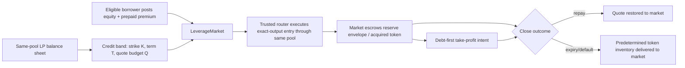

# Leveraged Hooks V2 — range-secured credit, reputation admission, and repayment orders

- **Research date:** 2026-08-17
- **Decision:** revise; do not enable the present same-pool quote-debt mechanism with reputation and limit orders alone
- **Recommended research track:** Hookr Credit Bands — narrow pool ranges converted into private, fully funded strike-value envelopes and accounted for by the credit market
- **Current evidence status:** mechanism proposal only; not implemented, audited, deployed, or safe for funds

This memo treats the attached *Leveraged Hooks — pool-native borrowing* PDF as design input, not as authority or instructions. It preserves the two product properties that matter:

1. capital is sourced from the same hooked pool rather than a separate lending pool; and
2. `LeverageMarket` remains the accounting authority for LP shares, positions, claims, fees, and realized losses.

It changes what the pool is owed. That change is load-bearing.

---

## 1. Executive decision

The existing design lends a scalar amount of quote, buys the risky token through the same pool, locks the acquired token, and later tries to sell that collateral through the same pool to recover quote. Reproduced stress tests show that this is reflexive: the pool is simultaneously lender, price source, execution venue, and loss absorber. When the asset gaps or a creator sells an existing bag, the collateral sale arrives after the pool's quote depth has already disappeared.

Neither of the proposed overlays repairs that balance sheet:

- **Reputation** can reduce who is allowed to create risk. It cannot turn token collateral into quote or make an impaired receivable worth par.
- **A mandatory take-profit order** can repay debt on an upward move. It never fills on a direct crash. A stop-limit can gap unfilled; a stop-market recreates the same reflexive liquidation.

The strongest no-second-pool redesign is:

> Do not lend generic quote with a promise to return quote. Lend an actual narrow price range and keep the resulting position inside a private, fully funded reserve envelope whose permitted token mixtures are fixed at origination.

For a long, the market advances quote from the same pool, the router buys the required token amount, and the market locks it. The lender is owed either:

- quote repayment while the borrower closes successfully; or
- the predetermined token amount at the agreed strike if the position expires or defaults.

That is economically a physically settled call for the borrower and a cash-secured put / limit buy for the LP. It eliminates forced downside selling and makes the maximum inventory exposure explicit. It does **not** make the LP riskless: if the token goes to zero, the LP can still lose the entire quote assigned to the band. The improvement is that this is declared, priced option risk rather than hidden bad debt carried at face.

There is a stricter promise: restore the exact original v4 range at every terminal tick. A convex, constant-sum reserve envelope can super-replicate the range in strike-value terms, but Hookr must still prove that actual token balances can pay v4's two-token add-liquidity delta after rounding. A borrower signature, reputation score, or ordinary public limit order is not that reserve envelope.

---

## 2. What was falsified

| Candidate | Same pool | No second capital pot | Survives direct crash | Creator/free-bag resistant | Decision |
|---|---:|---:|---:|---:|---|
| Current scalar quote debt | yes | yes | no | no | **killed** |
| Current debt + reputation gate | yes | yes | no | no | **killed as a solvency fix** |
| Current debt + take-profit / stop orders | yes | yes | no | no | **killed as a solvency fix** |
| Current debt + term-matched, prefunded quote backstop | yes | no | conditionally | conditionally | **viable but capital-inefficient** |
| Private funded range envelope / “swapper” | yes | yes, if the actual range is removed and encumbered | no forced downside sale | must still be gated and capped | **best research candidate** |
| Exact immediate v4 range restoration | yes | only if actual two-token deltas are always fundable | potentially | must still be tested | **unproven implementation property** |

### Reproduced evidence

The prior Hookr adversarial branches were replayed rather than accepted from prose:

- `LeverageSolvencySimTest`: 13/13 passed; stressed LPs underperformed the no-lending counterfactual in 9/10 scenarios. Approximate losses included 2.93 ETH on a gradual 85% decline, 4.53 ETH on a gap, 13.23 ETH on a pump/dump, and 39.64 ETH in the most adversarial path against 40 ETH borrowed.
- `LeverageEntryAttackTest`: 13/13 passed; a creator/free-bag 2x path produced about 4.49 ETH marginal attacker gain and the corresponding LP basket loss.
- `LeverageConditionalEnableTest`: 19/19 passed; sufficiently tiny caps can suppress a tested attacker, but price out useful credit and do not remove the positive marginal value of borrowed quote.
- `LeverageSynthDesignTest`: 17/17 passed; a synthetic exit price moved the exploit to oracle manipulation, and adding counter-arbitrage depth resurrected the exit-seller attack.
- `LeveragePledgeDesignTest`: 18/18 passed; a pledged-token version remained attackable and was worse in the base scenario.
- `SolvencyPassportHookTest`: 27/27 passed, including 256 fuzz cases; a term-matched, prefunded assignment backstop is mechanically promising, but it introduces a second funded capital layer.

That is 107 reproduced checks across the six mechanism suites. An independent attacker also reran the current `LeverageExploitsTest` suite: 20/20 passed. These are prototype/test results, not production assurance.

On remote main `ab853699dbd3d86d2be70b3ebade0bacd398cbad`, all 151 tracked leverage tests passed. Running the separate solvency stress harness against that same source still booked approximately 2.7261 ETH bad debt on the gradual-decline path and 4.5631 ETH on the one-block gap. A green implementation suite therefore does not establish the missing economic invariant.

The range-envelope inequality introduced below was also checked over 200,000 randomized real-number ranges and terminal prices. That validates the algebraic model, not Solidity rounding, v4 custody, or executable settlement.

### No-free-lunch statement

For a quote loan `Q` against a token whose terminal value can be zero, one of the following must be true:

1. `Q` is separately escrowed, in which case the trade is not meaningfully financed;
2. another party pre-funds or guarantees the quote exit;
3. LPs accept physical token settlement / option inventory risk; or
4. the system can create bad debt.

Reputation changes the probability assigned to item 4. It does not remove item 4.

---

## 3. The borrower's mandatory order idea

The idea is useful, but only after separating an **operational covenant** from a **solvency asset**.

### Long positions, which are the current Hookr product

| Order | Useful for | Not useful for |
|---|---|---|
| Take-profit limit sell | permissionless early repayment on a rally | direct crashes; guaranteed recovery |
| Stop-limit sell | bounded minimum price if a fill exists | gaps through the limit; thin-tail markets |
| Stop-market sell | eventually reducing token exposure | bounding proceeds; avoiding reflexive pressure |
| Unfunded promise to buy back | nothing enforceable | all recovery and capacity calculations |
| Prefunded opposing bid | committed recovery | preserving the no-second-pot constraint |

A simple counterexample is enough:

- equity = 2;
- debt = 2;
- exposure = 4;
- mandatory take-profit = +20%;
- asset gaps down 70%.

The order never crosses. Collateral is worth 1.2 against debt of 2, leaving 0.8 of shortfall before fees and impact.

For a future short product, the symmetric order is a buyback. It is enforceable only if short-sale quote proceeds or separate quote collateral remain escrowed. The current Hookr source is long-only, so a required “buy order” should not be added to the current position type.

### The V2 covenant

Start with one full-close take-profit order, not a multi-rung engine:

- created atomically with the position;
- collateral remains in market custody;
- irrevocable while any claim remains;
- executable by anyone after the committed price condition is met;
- all realized quote follows `principal claim -> earned/prepaid fees -> executor reward -> borrower residual`;
- replacement is allowed only after repayment or if it strictly reduces risk;
- expiry, reputation revocation, or a policy outage never cancels the order and never blocks close.

The order does not increase LTV, `creditCapacity`, NAV, or recovery value before it fills.

Current main deducts the keeper bonus before debt repayment; the tracked bonus-leak test proves that LP bad debt rises by the bonus. V2 must reverse that priority: the executor reward comes from prepaid budget or borrower surplus, never from senior recovery. See current [`LeverageMarket.sol`](src/LeverageMarket.sol#L950-L989).

OpenZeppelin's current experimental [`LimitOrderHook`](https://docs.openzeppelin.com/uniswap-hooks/api/general) is useful reference code for out-of-range, single-sided orders, but it cannot simply be attached to Hookr: a v4 pool has one hook, the reference order is owner-cancellable, and current Hookr accounting treats aggregate active liquidity as the market's full-range position.

Uniswap's own [range-order explanation](https://developers.uniswap.org/docs/get-started/concepts/liquidity-providers/range-orders) also makes the path dependency clear: after a range is crossed, the LP must remove it or a price recross can trade it back. A crossed tick is therefore not final debt repayment until Hookr has removed the range and booked actual proceeds.

---

## 4. Recommended mechanism: Hookr Credit Bands

The closest primary-source reference is InfinityPools' “swapper”: liquidity over one or more price ranges is borrowed, its maximum token/quote reserves define a strike, and the trader receives an option-like payoff rather than ordinary margin debt. Its documentation gives the same approximate leverage relation proposed below: `marketPrice / (marketPrice - strikePrice)`. See the official [swapper mechanism](https://docs.infinitypools.finance/protocol-overview/mechanism-details/swappers), [introduction](https://docs.infinitypools.finance/protocol-overview/introduction), and [payoff description](https://docs.infinitypools.finance/protocol-overview/tradfi-analogy/payoff).

Those pages are a design reference, not proof that a Hookr/v4 implementation inherits their claimed properties. Hookr needs its own executable invariant.

### 4.1 Product shape



At origination:

1. `LeverageMarket` checks asset admission, identity continuity, borrower tier, global exposure, and pool risk state before opening a PoolManager unlock.
2. The borrower selects a market-owned credit band with strike `K`, term `T`, and available quote notional `Q`.
3. The market/router executes an exact-output buy through the same pool for the reserve amount required by the band. The borrower supplies the difference between execution cost and `Q`, plus prepaid premium and bounded execution costs.
4. All acquired tokens remain locked. The market stores one strike-linked claim and one full-close take-profit covenant.
5. Accounting reclassifies pool credit inventory into a band claim. It does not book both the claim and the same locked collateral as two assets.

During the term:

- the borrower can repay quote and recover the residual position;
- a permissionless executor can fill the take-profit and route proceeds debt-first;
- no reputation or registry call is made on repayment, close, collateral addition, order execution, liquidation fallback, or claims;
- ordinary swaps remain independent of order-processing success.

At expiry/default:

- the private reserve account returns a permitted token mixture or the market takes the predetermined token reserve and extinguishes the quote claim;
- it does not dump the token through the same pool;
- LP NAV realizes the token inventory at a conservative mark instead of preserving a fictitious par receivable.

This removes bad debt only to the extent that the reserve envelope is actually funded and physically settleable. It does not erase economic loss versus holding quote.

### 4.2 Numerical example

Ignoring impact and fees:

- entry price `P0 = 1.00`;
- strike `K = 0.50`;
- same-pool quote budget `Q = 50,000`;
- required locked token `X = Q / K = 100,000`;
- entry cost `P0 * X = 100,000`;
- borrower equity `= 50,000`;
- exposure/equity `= 2x`.

If price rises to 1.50, selling 33,334 tokens can return 50,000 quote and leaves approximately 66,666 tokens for the borrower before premium and costs.

If price falls to 0.10 and the borrower does not repay, the market receives 100,000 tokens worth 10,000. The market has lost 40,000 versus quote, but it has not suffered a failed forced sale or an uncollectible 50,000 receivable. Economically, LPs executed the cash-secured limit buy they agreed to at 0.50.

The exact-output execution cost, not `P0 * X`, must be used onchain.

### 4.3 Leverage is encoded by the strike

For a narrow band and negligible impact:

```text
X = Q / K
equity = P0 * X - Q
leverage = (P0 * X) / equity = P0 / (P0 - K)
```

Therefore higher leverage means a strike closer to current price and more option risk for LPs. Reputation tiers may cap how close `K` may be to `P0`, but they may not relax the reserve invariant.

---

## 5. Exact range restoration is a stronger, separate promise

Let a v4 range have liquidity `L`, lower and upper square-root prices `A` and `B`, and terminal square-root price `S`. Ignoring integer rounding, its principal reserves are:

```text
S <= A:  xL = L(1/A - 1/B),  yL = 0
A < S < B: xL = L(1/S - 1/B), yL = L(S - A)
S >= B:  xL = 0,              yL = L(B - A)
```

Define:

```text
Xmax = L(1/A - 1/B)
Ymax = L(B - A)
K    = Ymax / Xmax = A * B
```

The range curve is below its endpoint chord, which is a constant-sum strike-value envelope:

```text
K * xL(S) + yL(S) <= Ymax

Ymax - (K * xL(S) + yL(S))
  = L(S - A)(B - S) / S
  >= 0
```

with equality at the endpoints. This convex-envelope fact explains why range borrowing can create an option-like payoff. For an account holding actual reserves `(x, y)`, the division-free solvency constraint is:

```text
Ymax * x + Xmax * y
  >= Xmax * Ymax + conservative rounding/fee buffer
```

A fully funded private “swapper” that never lets the borrower withdraw through that chord has enough strike-value to dominate the originating range curve. For several same-pair ranges, the aggregate curve remains convex and the global endpoint chord can be tested the same way.

It is not, by itself, a physical two-token settlement proof. To call `modifyLiquidity(+L)` at a terminal tick, v4 requires the actual token pair returned by that call, rounded against the payer. The private account must contain or be able to form that pair without dipping into unrelated market reserves.

The independent reviews converged on the chord proof and diverged on this physical step. One concludes that a fully funded private fixed-strike subaccount can form every required mix from the removed reserves plus borrower margin; the other shows that a token-heavy terminal account still needs real quote to pay PoolManager and that same-pool mark surplus can disappear under impact. That disagreement is not papered over here: immediate literal restoration remains **unproven** until an isolated harness restores the exact position at every terminal tick without touching sentinel reserves.

The strict no-subsidy condition is:

```text
escrowQuote
  + guaranteedQuoteOut(escrowToken - xL(S), terminal state)
  >= yL(S) + v4 rounding + swap fees + settlement costs

for every reachable S.
```

There are two ways to satisfy that last step:

1. a **funded private range account** owns the removed range reserves plus borrower margin, constrains every user withdrawal by the chord invariant, and implements a physically funded fixed-strike token-mix conversion; or
2. a **separately funded executable bid / dual-token escrow** supplies any missing side.

The first is the interesting no-second-*external*-pot path. It is not free credit: the borrowed v4 range is removed from public spot service while lent, and its reserves cannot simultaneously remain in the pool. The second is economically another capital tranche.

If Hookr cannot prove the private conversion from actual custody, then “guaranteedQuoteOut” must exclude the same distressed pool. With no funded bidder its worst-case value is zero, and the system must fall back to band-equivalent token settlement rather than claim literal range restoration.

Accordingly, V2 must choose one honest promise:

### V2-A — private funded range envelope (recommended prototype)

The market removes and encumbers an actual narrow range, combines its reserves with borrower margin, and locks the resulting position behind the chord invariant. It accepts quote or the predetermined token amount at strike and may hold token inventory after default. Until exact two-token conversion is proven, it does **not** promise immediate recreation of the original v4 range. This preserves the same-pool/no-second-external-pot constraint and removes reflexive liquidation.

### V2-B — literal immediate range restoration

The position carries a two-token reserve envelope, continuously funded mirror range, or independently funded/bonded quote bid sufficient to pay the actual v4 add-liquidity delta at every tick. This is a materially different capital model and must be priced as such.

Restoring principal `L` also does not restore counterfactual swap fees or rent that the absent range would have earned. The upfront premium must pay for that opportunity cost; it cannot be described as risk-free incremental yield.

### Current Hookr full-range liquidity cannot be borrowed this way

Hookr's present seeded position is effectively full-range. Its endpoint maxima are enormous relative to its current in-range token balances, so lifting a fraction of that range to the endpoint chord would require economically prohibitive borrower margin. The mechanism is useful with narrow, usually out-of-range tranches near the intended strike.

A V2 pool therefore needs at least two separately accounted market-owned allocations under the same hook:

- a locked core range that remains available for public spot depth; and
- narrow lendable credit bands that leave public spot service while borrowed.

The same liquidity cannot be counted in both allocations.

---

## 6. Reputation: useful admission control, never collateral

ERC-8004 is a useful identity/evidence envelope, but its current specification explicitly says Sybil inflation remains possible and expects applications to filter reviewers. It is still Draft. See the official [ERC-8004 specification](https://eips.ethereum.org/EIPS/eip-8004).

### 6.1 Hard requirements

All must pass before scoring:

- current identity wallet, equity payer, position owner, and residual claimant are the same account;
- a monotonic identity/wallet epoch has not changed during the seasoning window;
- minimum identity age and active-week history are satisfied;
- no unreimbursed shortfall, integrity revocation, or unresolved expired position;
- the borrower is not the token creator, deployer, fee recipient, launch affiliate, or publisher for the borrowed market;
- the target market is old and independently active enough to qualify; activity in that same market does not earn eligibility for it;
- same-quote exposure is aggregated across agent IDs, payer wallets, markets, and routers.

The creator-affiliation rule closes only the obvious wallet. It cannot prove that an undisclosed beneficiary is unrelated. New or concentrated launch assets therefore need their own quarantine regardless of borrower reputation.

### 6.2 Score inputs

Use economically costly, time-separated evidence:

```text
20% identity continuity / age
20% qualifying active weeks
40% mature, healthy Hookr credit history
10% filtered external reputation
10% distinct trusted client families
- liquidation, integrity, and unreimbursed-loss penalties
```

Do not count raw volume, transaction count, same-block loops, self-referrals, parallel dust positions, or feedback from unfiltered addresses.

One practical definition of a mature cycle is debt outstanding for at least seven days, time-weighted debt above a minimum percentage of contemporaneous market capacity, and full settlement without shortfall. Count at most one cycle per seven days and one debt-day per identity/payer across all markets.

### 6.3 Canary tiers — illustrative, not calibrated

| Tier | Minimum evidence | Max leverage | Per-market share of available band capacity | Max term |
|---|---|---:|---:|---:|
| T0 | below T1 | none | 0 | — |
| T1 | score >= 200; age >= 30d; 4 active weeks in 8; 2 trusted client families | 1.25x | 0.25% | 7d |
| T2 | score >= 400; age >= 90d; 8 active weeks in 16; 3 mature closes; 21 debt-days | 1.50x | 0.75% | 30d |
| T3 | score >= 750; age >= 180d; 16 active weeks in 26; 10 mature closes; 90 debt-days | 2.00x | 1.50% | 60d |

Use aggregate containment as well:

- all T1 positions together: at most 10% of a market's available band capacity;
- T1 + T2 together: at most 40%;
- per-payer and per-identity caps both apply;
- protocol-wide same-quote caps apply before market caps;
- snapshot freshness at open: at most six hours;
- positive reputation decays; unreimbursed economic loss hard-disables new positions.

For identity `i`, payer `p`, and market `m`:

```text
maxBorrow(i,p,m) = min(
  leverageTierHeadroom,
  tierShare * availableBandCapacity(m),
  perAssetZeroPriceLossBudget,
  payerGlobalHeadroom,
  identityGlobalHeadroom,
  protocolSameQuoteHeadroom,
  exactExecutableEntryCapacity
)
```

Reputation can only reduce this minimum. It never creates pool capacity, raises NAV, changes collateral value, delays an already-valid close, or prevents physical settlement.

### 6.4 Entry-only semantics

Check the passport in `LeverageMarket.openPosition` before PoolManager `unlock`. The hook sees the market/router as `sender`, not necessarily the borrower, and caller-supplied `hookData` is not authentication.

Eligibility gates only:

- open;
- increase notional;
- extend term; and
- move to a riskier strike.

It never gates:

- repay or repay-for;
- add collateral/reserves;
- execute the standing order;
- reduce/close;
- expiry/default settlement;
- keeper actions; or
- LP claims.

The prior Hookr Agent Gate branch rechecked eligibility on sells in strict mode and can block exits after revocation. That behavior must not be reused for leverage.

---

## 7. Accounting changes

The current balance sheet uses scalar debt and tries to mark recoverability from collateral. V2 should store an explicit band/strike claim.

```solidity
struct CreditBandPosition {
    address owner;
    uint256 agentId;
    uint64 walletEpoch;
    int24 tickLower;
    int24 tickUpper;
    uint128 bandLiquidity;
    uint128 quoteNotional;
    uint128 tokenEscrow;
    uint128 prepaidPremium;
    uint40 openedAt;
    uint40 maturity;
    uint160 takeProfitSqrtPriceX96;
    bytes32 policyHash;
    PositionStatus status;
}
```

The exact fields depend on whether V2-A or V2-B is chosen; this is a bookkeeping shape, not implementation-ready ABI.

### Balance-sheet rules

- On open, reclassify credit inventory into one `BandClaim`; do not mint market equity.
- Carry the claim at no more than `min(quoteNotional, stressedTokenEscrowValue - settlementCosts)` for LP exits.
- Count prepaid/earned premium only once and on the actual vesting schedule.
- Never count borrower collateral, an unfilled order, and the band claim as three assets.
- On physical settlement, remove the claim and add actual market-owned token inventory. Do not call the quote difference “bad debt”; the conservative mark has already recognized the economic loss.
- Preserve a separate cumulative economic-loss metric so renaming settlement does not hide LP drawdown.
- A `$HOOKR` minimum or reputation score is not a balance-sheet asset. It may enter recovery only if actually escrowed, slashable, and senior proceeds are contractually routed to the market.

### v4 position accounting

Current Hookr code reads aggregate active pool liquidity and values it as one salt-zero full-range market position. Market-owned credit bands or borrower order ranges would invalidate that assumption and can inflate NAV and `creditCapacity`.

V2 must track each market-owned position key `(tickLower, tickUpper, salt)` and its actual deltas separately:

- active trading inventory;
- unloaned credit bands;
- loaned band claims;
- standing order escrow; and
- borrower residual liabilities.

Do not use `PoolManager.getLiquidity(poolId)` as proof that the market owns or can withdraw a particular range.

---

## 8. Hook and execution boundaries

The hook should remain a bounded sensor and gate:

- write observations;
- expose protected/stale/deviation state;
- identify that a take-profit threshold was crossed;
- enforce market-only liquidity modification; and
- reject new risk when inputs are stale or inconsistent.

The hook should not execute a nested swap from `beforeSwap`/`afterSwap`, call an external reputation publisher during a swap callback, or process an unbounded order queue. Uniswap's current [v4 security framework](https://developers.uniswap.org/docs/protocols/v4/security) warns that external calls inside callbacks invalidate assumptions about atomicity, ordering, and liquidity state.

Execution belongs in a separate `LeverageMarket`/router call:

1. snapshot the actual pre-settlement pool state;
2. validate independent/staged risk inputs;
3. consume the position/order nonce;
4. open one PoolManager unlock;
5. perform bounded swap/liquidity operations;
6. settle all deltas;
7. update the credit book from actual returned amounts; and
8. assert token/quote conservation.

An order trigger can enqueue or make a position executable. It must not make an unrelated ordinary swap revert.

---

## 9. Asset admission is as important as borrower admission

The reproduced creator/free-bag attack is not fixed by a reputable borrower if that borrower controls or coordinates with the asset issuer. A canary market should require:

- a minimum market age and observation history;
- no leverage during launch or immediately after a migration;
- independent price or fail-closed origination when no independent mark exists;
- time-separated organic activity, not volume alone;
- explicit creator/deployer/fee-recipient exclusion;
- a per-asset zero-price loss budget; and
- a protocol kill switch that blocks only new/increased risk.

For new Hookr launch assets, the safer product remains nonwithdrawable, purpose-bound launch credit or token reservation rather than spot leverage. The purchased asset stays locked and credit cannot be extracted as generic cash.

---

## 10. Required prototype and kill criteria

### Phase 0 — math/state prototype only

Build an isolated Foundry harness against current `hookr-org/main`, not the stale working branch. It must prove or falsify:

1. exact v4 remove/re-add deltas at every initialized and uninitialized tick, including rounding dust;
2. the reserve-envelope inequality for one range and sums of non-adjacent ranges;
3. physical settlement below, inside, and above the borrowed range;
4. immediate remove/re-add cannot manufacture value;
5. cross, recross, partial fill, and expiry paths;
6. a same-pool price push cannot reduce what the position owes by more than the attack cost measured at an independent mark;
7. the creator/free-bag attack under identical initial state and external order flow;
8. take-profit gap paths and zero-fill paths;
9. order processing cannot freeze ordinary swaps;
10. no nested PoolManager unlock and no external callback dependency;
11. NAV counts every asset and liability once; and
12. per-position, per-payer, per-identity, per-asset, and same-quote global caps survive a seasoned-Sybil swarm.

Add a targeted regression where an inner queued sell moves spot beyond the outer user's signed `sqrtPriceLimitX96`. Current source can let the later core price-limit check revert the entire outer swap after the hook's `try/catch` has already returned. Also prove that collateral and debt change from actual filled deltas, never the requested seize amount, under partial fills.

### Immediate kill criteria

Kill or redesign the candidate if any is true:

- a borrower order increases credit capacity before independently funded value is escrowed;
- reputation changes NAV, health, settlement assets, or exit permissions;
- any policy, registry, router, or publisher outage blocks risk reduction;
- the system promises exact range restoration but relies on selling into the distressed same pool;
- a terminal tick can require more of either token than the isolated position controls;
- active order/range liquidity is included in full-range accounting or counted twice;
- a price gap leaves no physical settlement or bounded permissionless fallback;
- a creator/free-bag path produces positive marginal profit beyond the explicitly priced option payoff and declared per-asset loss budget;
- the mechanism needs quote-par recovery while refusing both a prefunded quote backstop and token settlement; or
- ordinary swaps can fail because order work is unbounded.

### Evidence needed before any canary

- exact main SHA and clean provenance;
- Foundry unit, fuzz, invariant, and adversarial replay evidence;
- independent accounting and v4 callback review;
- bounded canary configuration with zero-price maximum loss stated in quote;
- source, deployment, signer, receipt, and post-deployment readback kept as separate evidence;
- UI language that says “physically settled range credit” / “LP option inventory risk,” not “guaranteed repayment” or “no risk.”

---

## 11. Recommended implementation sequence

1. **Retire scalar quote debt as the target architecture.** Keep it research-only and keep the stress tests as permanent regressions.
2. **Prototype V2-A first.** One narrow out-of-range credit band, one private reserve envelope, one fixed term, one full-close take-profit, physical token settlement, upfront premium, no partial fills, no shorts.
3. **Add the Credit Passport.** Entry-only gating, wallet epoch, payer aggregation, asset quarantine, and canary tier caps.
4. **Rewrite position-aware accounting.** Exact v4 position keys and actual deltas; no aggregate-liquidity shortcut.
5. **Attack the combined system.** Creator bag, bought bag, oracle manipulation, cross/recross, expiry, Sybil seasoning, publisher compromise, and queue gas grief under one scorecard.
6. **Decide whether V2-B is worth the capital.** If literal range restoration is required, add dual reserves or a funded bidder and measure the capital efficiency honestly.

The product sentence for V2-A is:

> Hookr LPs lend an actual narrow price band from the same pool. An eligible trader uses it for a leveraged long, while the market keeps the band reserves and margin inside a private strike-value envelope. A standing take-profit can repay early; reputation controls access, never solvency.

That is the smallest redesign that preserves the hook-native product idea without pretending an order or a reputation score is money.
