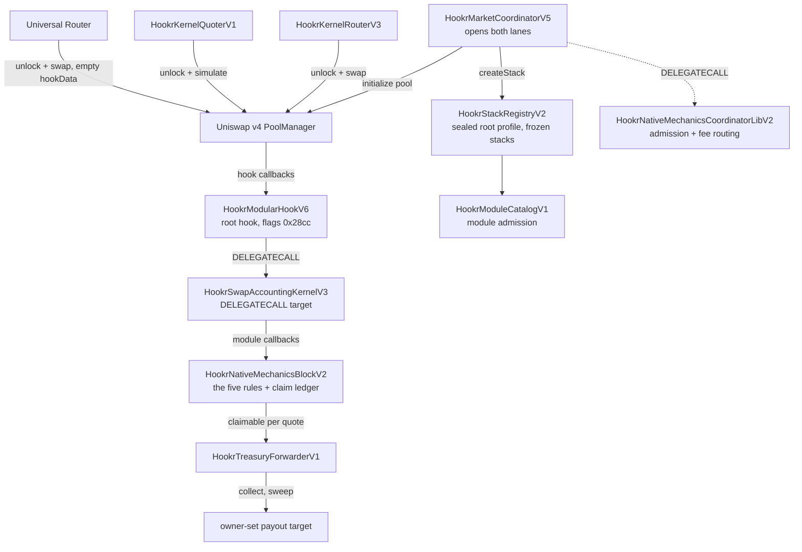

# Architecture

Thirteen addresses make up the release: one root hook, the accounting kernel it delegates to, one module, the catalog and registry that admit modules and pools, the coordinator that opens markets, three libraries deployed for it (admission, token deployer, creator buy), a router, a quoter, the treasury forwarder, and the CREATE2 factory the root was mined through. Three more libraries were already on chain and are linked where they stand. This page says what each one is for and how a swap moves through them.

## The Pieces

**`HookrModularHookV6`** is the root hook. Its address is mined so the low fourteen bits equal `0x28cc`, and every Hookr pool names it in `PoolKey.hooks`. It inherits `HookrSwapKernelV3`.

**`HookrSwapKernelV3`** is the hook's swap entry point. It resolves the pool's frozen stack, authenticates the caller against the pool's trusted router and quoter, and forwards the callback to the accounting kernel by `DELEGATECALL` so all state stays in the root's own storage.

**`HookrSwapAccountingKernelV3`** implements the callback bodies: it walks the pool's frozen modules, enforces the per-pool caps on what any module may take, computes the `BeforeSwapDelta` and the `afterSwap` delta, and credits claims. The kernel pair is deployed as two contracts because the root's runtime must stay inside the EIP-170 limit while carrying the full accounting path.

**`HookrNativeMechanicsBlockV2`** is the module that holds the five rules. It is a stateful module: the kernel calls it inside the swap, it reads the PoolManager and updates its own ledgers, and the kernel alone executes the resulting PoolManager actions. It owns the per-quote claim ledger that pays the pot, the royalty and the protocol share.

**`HookrModuleCatalogV1`** admits module implementations. A registration pins the implementation address, its runtime code hash, its config schema hash and the structural maxima it may ever request. Registration is permanent; there is no updater.

**`HookrStackRegistryV2`** admits pools. It seals root profiles, each listing a kernel, the allowed modules and the trusted router and quoter integrations, then freezes one stack per `PoolId` inside that envelope. Every pool runs on a sealed profile; there is no per-market hook instance.

**`HookrMarketCoordinatorV5`** is the only address the registry accepts stacks from. It opens both lanes, holds the founding position for the new-token lane, resolves the protocol share for the creator, and exposes the treasury address the admission library checks against.

**`HookrNativeMechanicsCoordinatorLibV2`** is the coordinator's admission library, executed by `DELEGATECALL`. It proves the selected module is the one canonical native block at the right version and schema, that the config's protocol share equals what the coordinator resolves for this creator, that the module's immutable recipient is the coordinator's own treasury, and that a guard window is only requested on the new-token lane. It also routes founding-position fees at collect time.

**`HookrKernelRouterV3`** is the trusted router. It settles exact-input and exact-output swaps and carries an authenticated payer and recipient in `hookData`, which is what lets the hook credit the pot to a wallet rather than to a router contract.

**`HookrKernelQuoterV1`** is the trusted quoter. It simulates a swap through the same code path and reverts with the result, so a quote sees the same fee and the same cuts a real swap would pay.

**`HookrTreasuryForwarderV1`** is the address pinned as both the coordinator's treasury and the module's protocol recipient. It holds no protocol authority. Its permissionless `collect(quote)` pulls the module's accrual and pushes it to one owner-settable target.

**`HookrMarketCoordinatorTokenDeployerV3`** is the linked library that deploys a new-token market's ERC-20 with CREATE2, so the token address is predictable from the launch arguments before the transaction is sent.

**`HookrMarketCoordinatorInitialBuyLibV4`** is the linked library that validates and executes the creator's same-transaction buy.

## How They Fit

## Call Flow of One Swap

1. A caller unlocks the PoolManager and requests a swap on a Hookr `PoolKey`.
2. The PoolManager calls `beforeSwap` on the root hook.
3. The root reads the pool's frozen stack, checks whether the caller is the pool's trusted router or quoter at its registered code hash, and decodes `hookData` only for a trusted caller.
4. The root delegates to the accounting kernel, which calls `beforeSwapStateful` on the native block.
5. The block returns the LP-fee override and, on an exact-input buy, the quote-side takes. The kernel checks them against the pool's frozen caps, credits the claims, and returns a `BeforeSwapDelta`.
6. The PoolManager executes the swap at the overridden fee.
7. `afterSwap` runs the same path for the unspecified-leg take and the burn, returning an `afterSwap` delta.

Every step reads immutable state. The only mutable inputs are pool liquidity and price, the guard counters, and the pot counters.
