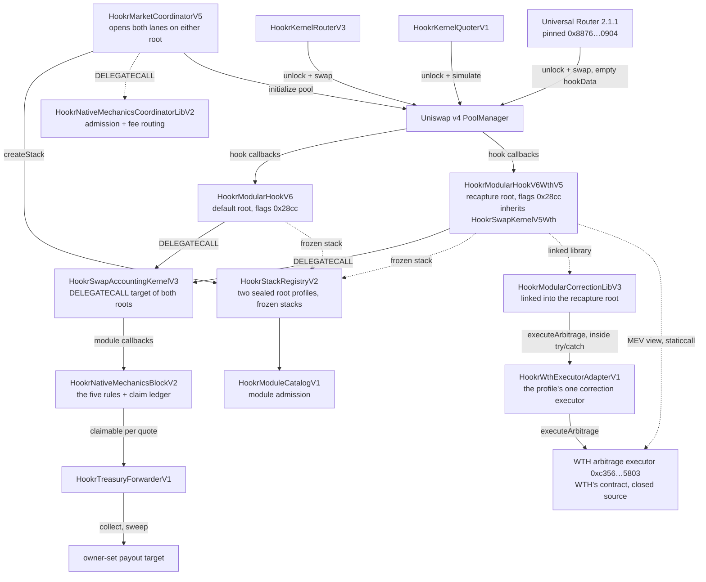

# Architecture

Thirteen addresses make up the default lineage: one root hook, the accounting kernel it delegates to, one module, the catalog and registry that admit modules and pools, the coordinator that opens markets, three libraries deployed for it (admission, token deployer, creator buy), a router, a quoter, the treasury forwarder, and the CREATE2 factory the root was mined through. Three more libraries were already on chain and are linked where they stand. A second root, the recapture root, joined that graph on 2026-09-12 with three addresses of its own: the root itself, the correction library it links, and the adapter its sealed profile names as the one correction executor. Everything else it uses is shared with the default root. This page says what each one is for and how a swap moves through them.

## The Pieces

**`HookrModularHookV6`** is the default root hook. Its address is mined so the low fourteen bits equal `0x28cc`, and every pool opened on the default kernel id names it in `PoolKey.hooks`. It inherits `HookrSwapKernelV3`.

**`HookrSwapKernelV3`** is the default root's swap entry point. It resolves the pool's frozen stack, authenticates the caller against the pool's trusted router and quoter, and forwards the callback to the accounting kernel by `DELEGATECALL` so all state stays in the root's own storage. It carries a correction lane that the default root's sealed profile leaves unnamed, so on that root the lane never runs.

**`HookrModularHookV6WthV5`** is the recapture root hook. Same constructor, same flags, same address-mining rule and the same four wiring arguments as the default root (PoolManager, registry, coordinator, accounting kernel), and every pool opened on the recapture kernel id names it. It inherits `HookrSwapKernelV5Wth`.

**`HookrSwapKernelV5Wth`** is the recapture root's swap entry point: a copy of `HookrSwapKernelV3`, not a subclass, because nothing that decides whether a correction runs is virtual there. Five things differ and nothing else does. The correction attempt no longer requires a trusted caller, so a Universal Router swap reaches the executor too. Both `beforeSwap` and `afterSwap` attempt it, with or without a signed plan. An unauthenticated caller gets no rebate recipient, so a router contract can never be paid the trader's share. It links `HookrModularCorrectionLibV3`, which makes the plan optional. And the correction window admits two senders, the pool's frozen executor and the one contract that executor forwards to. It also adds one refusal, `MevCallbackRefused`, described under the call flow below. It delegates to the same `HookrSwapAccountingKernelV3` as the default root, so the five rules run on identical code and both sealed profiles carry the same `moduleSetHash`.

**`HookrModularCorrectionLibV3`** is the recapture root's linked correction dispatcher. Called inside the kernel's `try/catch`, it builds the split (creator, trader, the triggering pool's LPs; WTH and Hookr are settled inside the executor), validates a signed plan if one arrived, and calls the pool's frozen correction executor with a 2,300,000-gas stipend. It reports success, failure or a skip with a reason hash, and the kernel emits one of the three `CorrectionAttempt*` events. It is linked where it stands at `0x11996B4e04571718d49454fC52830dc7fA0FF99C`, an address that holds no verified source; the file is in the root's verified bundle.

**`HookrWthExecutorAdapterV1`** is the one correction executor the recapture profile admits. It answers the two interfaces the kernel and the registry require, checks that its caller is the frozen root of a pool that names it, checks the split against the pool's frozen creator, and forwards one narrowed call, `executeArbitrage(triggeringPool, rebateRecipient, split)`, to WTH's executor with at most 2,200,000 gas. It holds no funds and keeps no accounting; WTH's executor pays every recipient directly. Its `wthExecutor` was set once by `setExecutorOnce` and can never move.

**WTH's executor** at `0xc356cf51134e0DF02BFE880115DD8c66Ead45803` is not a Hookr contract. It is closed source and unverified, and it is the contract that actually trades the gap and pays out. Everything Hookr-side is arranged so that its failure or misbehaviour can skip a correction but cannot fail a user's swap, except for the MEV refusal below, which is read from it with a bounded `staticcall` and fires only on a clean single `true`.

**`HookrSwapAccountingKernelV3`** implements the callback bodies for both roots: it walks the pool's frozen modules, enforces the per-pool caps on what any module may take, computes the `BeforeSwapDelta` and the `afterSwap` delta, and credits claims. The kernel pair is deployed as two contracts because a root's runtime must stay inside the EIP-170 limit while carrying the full accounting path.

**`HookrNativeMechanicsBlockV2`** is the module that holds the five rules. It is a stateful module: the kernel calls it inside the swap, it reads the PoolManager and updates its own ledgers, and the kernel alone executes the resulting PoolManager actions. It owns the per-quote claim ledger that pays the pot, the royalty and the protocol share. Both sealed profiles name it as their one module.

**`HookrModuleCatalogV1`** admits module implementations. A registration pins the implementation address, its runtime code hash, its config schema hash and the structural maxima it may ever request. Registration is permanent; there is no updater.

**`HookrStackRegistryV2`** admits pools. It seals root profiles, each listing a kernel, the allowed modules, the trusted router and quoter integrations and, optionally, one correction-executor integration, then freezes one stack per `PoolId` inside that envelope. Two profiles are sealed on it today, one per root. Every pool runs on a sealed profile; there is no per-market hook instance. A correction executor is admitted on a pool only when the quote is native ETH sorted as `currency0`, the creator is non-zero, and the executor answers the fee policy id the stack carries.

**`HookrMarketCoordinatorV5`** is the only address the registry accepts stacks from. It opens both lanes on either root, selected by the kernel id in the market parameters, holds the founding position for the new-token lane, resolves the protocol share for the creator, and exposes the treasury address the admission library checks against.

**`HookrNativeMechanicsCoordinatorLibV2`** is the coordinator's admission library, executed by `DELEGATECALL`. It proves the selected module is the one canonical native block at the right version and schema, that the config's protocol share equals what the coordinator resolves for this creator, that the module's immutable recipient is the coordinator's own treasury, and that a guard window is only requested on the new-token lane. It also routes founding-position fees at collect time.

**`HookrKernelRouterV3`** is the trusted router. It settles exact-input and exact-output swaps and carries an authenticated payer and recipient in `hookData`, which is what lets the hook credit the pot to a wallet rather than to a router contract, and on the recapture root what lets the trader's share of a correction reach the trader.

**`HookrKernelQuoterV1`** is the trusted quoter. It simulates a swap through the same code path and reverts with the result, so a quote sees the same fee and the same cuts a real swap would pay.

**`HookrTreasuryForwarderV1`** is the address pinned as both the coordinator's treasury and the module's protocol recipient. It holds no protocol authority. Its permissionless `collect(quote)` pulls the module's accrual and pushes it to one owner-settable target.

**`HookrMarketCoordinatorTokenDeployerV3`** is the linked library that deploys a new-token market's ERC-20 with CREATE2, so the token address is predictable from the launch arguments before the transaction is sent.

**`HookrMarketCoordinatorInitialBuyLibV4`** is the linked library that validates and executes the creator's same-transaction buy.

## Two Roots

| | Default root | Recapture root |
| --- | --- | --- |
| Contract | `HookrModularHookV6` | `HookrModularHookV6WthV5` |
| Address | `0xb3cA29cF721380CEe8b8e4755F3865Ebc68Fe8cC` | `0xb914f955294799de4b891bd2EA8AF628Fa1c68CC` |
| Swap kernel base | `HookrSwapKernelV3` | `HookrSwapKernelV5Wth` |
| Accounting kernel | `HookrSwapAccountingKernelV3`, by `DELEGATECALL` | the same contract, by `DELEGATECALL` |
| Linked correction library | `HookrModularCorrectionLibV2` (never reached) | `HookrModularCorrectionLibV3` |
| Kernel id | `0x1be0c118…be14` | `0xd8b6c165…555a` |
| Sealed profile id | `keccak256("HOOKR_LAUNCH_V2_MIN_ROOT_PROFILE")` | `keccak256("HOOKR_LAUNCH_V2_MIN_WTH_ROOT_PROFILE_V5")` |
| Module set | the native block, `moduleSetHash 0x8fafd562…8304` | identical |
| Correction executor in the profile | none | `HookrWthExecutorAdapterV1` |
| Quote currencies | any | any for the five rules; only native ETH may carry the correction lane, and a pool without it is a plain pool wearing this root's name |
| Can a swap fail on a partner's answer | no | yes, `MevCallbackRefused`, only on a clean `true` from WTH's MEV view |
| Uniswap routing allowlist and hooklist | listed | not listed (checked 2026-09-21) |

## How They Fit

## Call Flow of One Swap

1. A caller unlocks the PoolManager and requests a swap on a Hookr `PoolKey`.
2. The PoolManager calls `beforeSwap` on the pool's root hook.
3. The root reads the pool's frozen stack, checks whether the caller is the pool's trusted router or quoter at its registered code hash, and decodes `hookData` only for a trusted caller.
4. The root delegates to the accounting kernel, which calls `beforeSwapStateful` on the native block.
5. The block returns the LP-fee override and, on an exact-input buy, the quote-side takes. The kernel checks them against the pool's frozen caps, credits the claims, and returns a `BeforeSwapDelta`.
6. The PoolManager executes the swap at the overridden fee.
7. `afterSwap` runs the same path for the unspecified-leg take and the burn, returning an `afterSwap` delta.
8. On the recapture root only, two more things happen on a pool whose frozen stack names the adapter. Before step 4, the root reads the adapter's bound executor and asks its MEV view, with a 200,000-gas `staticcall`, whether a v3 pool in WTH's registry for this pair is currently locked; a clean `true` means the caller is closing an arbitrage leg inside that pool's callback, and the swap reverts `MevCallbackRefused`. Anything else, including a revert or a missing function, lets the swap proceed. Then, after step 5 and again after step 7, the root runs one bounded correction attempt through the linked library to the adapter and on to WTH's executor, sized from the swap's subject amount (for a quote-denominated `beforeSwap`, converted at the pool's spot price). The executor may swap back into this pool during that window, which the root admits only from the adapter or its bound executor, only on this pool, and only with empty `hookData`. Whatever happens in the attempt is reported as `CorrectionAttemptSucceeded`, `CorrectionAttemptFailed` or `CorrectionAttemptSkipped`; a revert inside it is a skipped correction, never a failed swap.

Every step reads immutable state. The only mutable inputs are pool liquidity and price, the guard counters, the pot counters, and, on the recapture root, whatever WTH's executor does with the gap.
